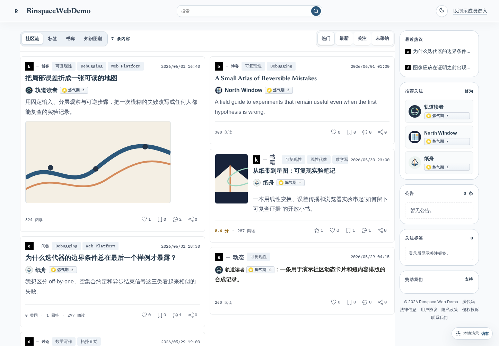
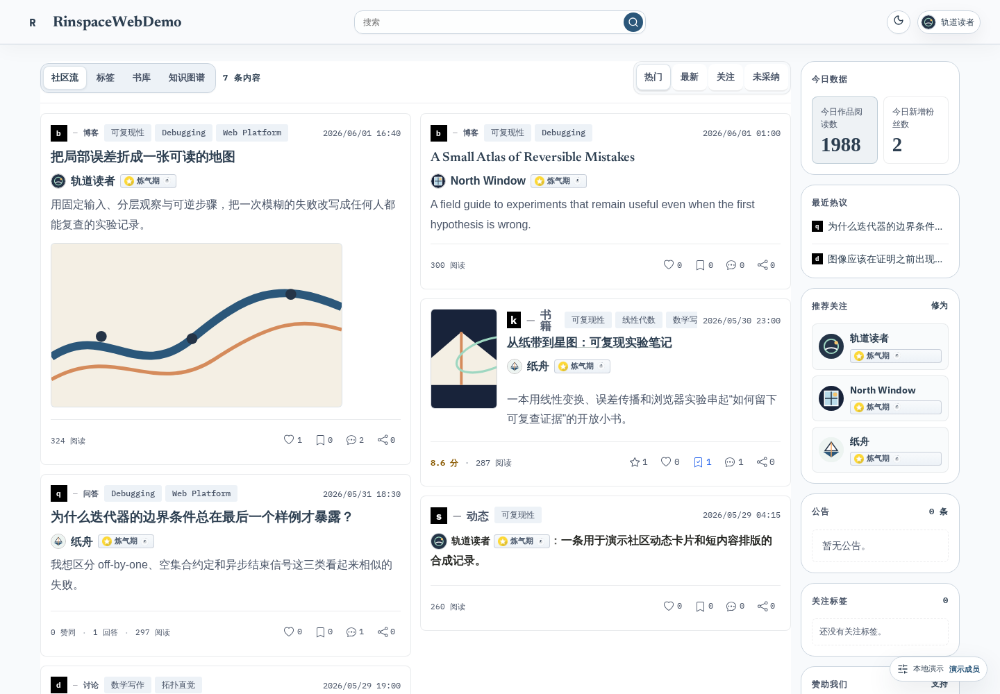
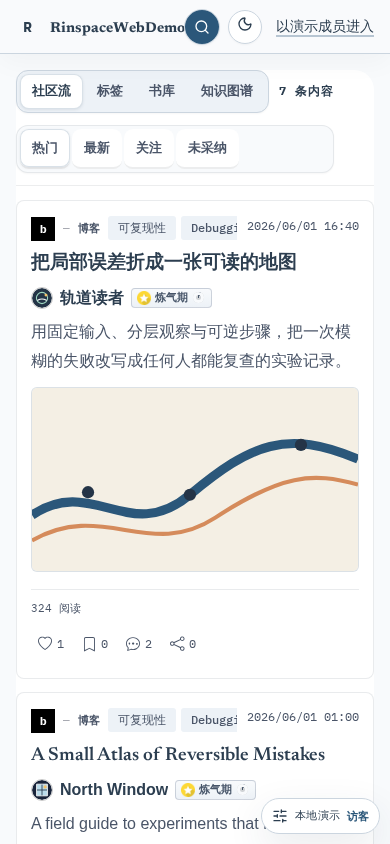
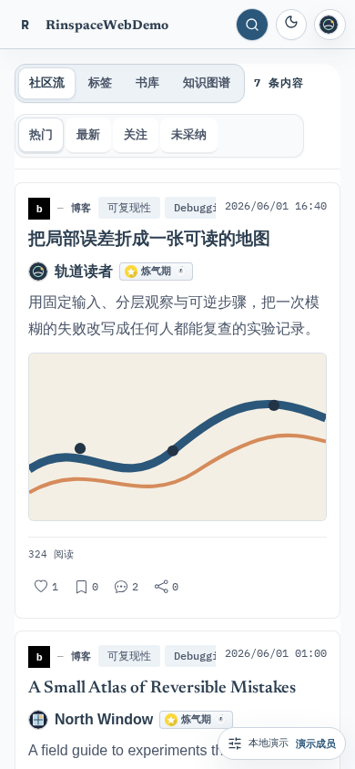

# Rinspace Web

[English](./README.md)

<!-- rinspace-section: product -->

## 产品定位

Rinspace Web 是 Rinspace（芥子环）的浏览器前端与本地演示运行时。它覆盖以 Tag 为中心的长文知识社区界面，包括 Markdown、LaTeX、书籍、讨论、个人资料、通知和创作者工作流。

本仓库不是可完整自托管的 Rinspace 服务：它不包含私有生产 API、数据库、Control Plane、Renderer、Gitea、code-server、支付回调、短信发送或对象存储服务。内置 demo 只使用确定性的合成数据和浏览器本地存储。

<!-- rinspace-section: scope -->

## 范围与运行模式

同一份源码和同一份带哈希 core 产物支持三种经过校验的运行模式：

| 模式          | 用途                      | 网络边界                                               |
| ------------- | ------------------------- | ------------------------------------------------------ |
| `demo`        | 安全产品体验与前端贡献    | 同源 MSW + 浏览器本地仓储；外部请求失败关闭            |
| `integration` | 连接独立运营的兼容后端    | 显式的兼容认证/API/integration endpoint                |
| `official`    | Rinspace 运营同一公开前端 | CloudBase 浏览器公开认证配置与 Rinspace 服务端 adapter |

85 条路由不是 85 个接入入口；它们统一消费 auth、HTTP、upload、renderer 和 workspace port。production-only 能力见[生产能力边界](./docs/production-capabilities.md)。

<!-- rinspace-section: demo -->

## Demo 身份与数据

- `guest` 展示匿名产品、公开内容、登录门禁和空状态。
- `member` 是合成本地身份，可关注、投票、评论、修改设置、读取通知、创作 Markdown/LaTeX 并在本地发布。
- 两者都没有管理员角色、真实 JWT 或生产凭据。
- Vitest、MSW、Playwright 与截图共用同一版本化 seed；reset 会精确恢复该 seed。

通过页面下沿的 demo 控制入口切换 persona，或选择可复现的错误/延迟 scenario。

<!-- rinspace-section: screenshots -->

## 截图

以下图片由 `pnpm capture:demo-screenshots` 从固定本地 seed 生成，不含生产响应或真实账号。

| Guest · 桌面                                                           | Member · 桌面                                                            |
| ---------------------------------------------------------------------- | ------------------------------------------------------------------------ |
|  |  |

| Guest · 移动端                                                        | Member · 移动端                                                         |
| --------------------------------------------------------------------- | ----------------------------------------------------------------------- |
|  |  |

<!-- rinspace-section: quick-start -->

## 对新手友好的快速开始

不需要数据库、账号、CloudBase 项目或 `.env`。先按自己的目标选择最简单的路径：

| 目标                                | 推荐路径                                | 需要安装         |
| ----------------------------------- | --------------------------------------- | ---------------- |
| 不学习 Node.js 或 pnpm，只体验 demo | [Docker 与 Compose](#docker-与-compose) | 只安装 Docker    |
| 阅读或修改源码，并获得热更新        | 下方本地开发方式                        | Git + Node.js 22 |
| 生成可交给静态托管平台的文件        | [静态部署](#静态部署)                   | Git + Node.js 22 |

### 1. 在 Windows、macOS 或 Linux 安装 Git 与 Node.js

Rinspace Web 文档约定并由 CI 验证的是 **Node.js 22.x**。官网可能默认选择更新的大版本，请在 [Node.js 下载页](https://nodejs.org/en/download)明确选择 22。若 `git --version` 不可用，还需安装 [Git](https://git-scm.com/downloads)。

| 系统          | 适合新手的安装方式                                                                                     | 使用的终端                     |
| ------------- | ------------------------------------------------------------------------------------------------------ | ------------------------------ |
| Windows 10/11 | 安装 Git for Windows 和 Node.js 22 Windows 安装包，保留安装程序默认的 PATH 选项。                      | PowerShell 或 Windows Terminal |
| macOS         | 安装 Node.js 22 macOS 安装包；若系统提示安装命令行工具，按提示补装 Git。                               | “终端”应用                     |
| Linux         | 用发行版包管理器安装 Git，再按官网说明或用版本管理器安装 Node.js 22；发行版仓库里的 Node.js 可能过旧。 | 常用 shell                     |

安装后关闭并重新打开终端，再检查：

```bash
git --version
node --version
npm --version
```

`node --version` 应以 `v22.` 开头。然后克隆仓库并进入目录：

```bash
git clone https://github.com/lunifans/rinspace-web.git
cd rinspace-web
```

### 2. 用 pnpm 启动 Demo

pnpm 只是本项目用来安装 JavaScript 依赖和运行脚本的包管理器，作用类似 npm；不会使用 pnpm 也没关系。仓库已经固定 pnpm 9.7.0，请不要替换 `pnpm-lock.yaml`，也不要用 `npm install` 安装项目依赖。

正常情况下直接复制以下命令：

```bash
corepack enable
pnpm --version
pnpm install --frozen-lockfile
pnpm start
```

打开 <http://127.0.0.1:5173/>。体验期间保持终端运行；按 <kbd>Ctrl</kbd>+<kbd>C</kbd> 停止。

如果系统提示 `pnpm`“不是内部或外部命令”或 `command not found`，无需修改系统权限，直接通过 Corepack 运行：

```bash
corepack pnpm --version
corepack pnpm install --frozen-lockfile
corepack pnpm start
```

如果连 `corepack` 也不可用，但 `npm --version` 正常，可一次性安装项目指定版本，再重试正常命令：

```bash
npm install --global pnpm@9.7.0
pnpm --version
```

如果系统阻止安装全局工具，请参考 [pnpm 官方安装说明](https://pnpm.io/installation)。干净 checkout 文档门禁会测量前置工具就绪后从安装到 ready 的实际耗时，并验证 demo 不发出外部请求；Task 27 记录实际证据，不把未验证平台写成性能承诺。

<!-- rinspace-section: reset -->

## 重置本地 Demo

打开 demo 控制面，选择 **重置演示数据** 并确认。它只重置 Rinspace namespaced demo repository 与 scenario，保留 persona、语言、主题及无关浏览器存储。

如果 bootstrap 无法完成，可使用独立错误页的 **重置演示**。手工处理时只清理本地 origin 的站点数据；不要让 demo 复用 official 生产 origin。

<!-- rinspace-section: static-deployment -->

## 静态部署

完成上方本地安装后，在仓库根目录运行以下命令。core 只构建一次，然后在不重新编译的情况下组装根路径外壳，并预览将要部署的准确目录：

```bash
pnpm build
pnpm package -- --config config/runtime.demo.json --out package
pnpm preview:artifact -- --root package --port 4173
```

打开 <http://127.0.0.1:4173/>。可部署文件位于 `package/`；按 <kbd>Ctrl</kbd>+<kbd>C</kbd> 停止预览。

子路径必须选用 `basePath`、本地 API、canonical、manifest scope 和 worker scope 一致的配置。以下示例部署到 `/rinspace-demo/`：

```bash
pnpm package -- --config config/runtime.demo.subpath.json --out package-subpath --base-path /rinspace-demo/
pnpm preview:artifact -- --root package-subpath --port 4173
```

打开 <http://127.0.0.1:4173/rinspace-demo/>。正式部署到真实域名前，复制 `config/` 中最接近需求的配置，填写公开的 `canonicalOrigin`、`basePath` 和同前缀 API 路径，再把该文件交给 `pnpm package`。配置会被所有浏览器下载，绝不能放入密码、token、私钥、数据库 URL、内部地址或真实用户数据。

部署检查清单：

1. 上传 `package/` 的**全部内容**（或完整子路径布局），包括点文件和生成的 metadata；不能只上传 `index.html` 或 `assets/`。
2. 托管平台支持时应用 `_headers` 与 `_redirects`；使用其他服务器时，将 `static-headers.json` 精确转换为等价的 CSP、缓存与 Service Worker 规则。
3. 浏览器页面导航需要 SPA fallback 到匹配的 `index.html`，但缺失的 JS、CSS、字体、图片等资源必须返回真实 `404`，不能返回 HTML。
4. 访问首页并直接刷新一个深层 URL；确认 `/runtime-config.json` 和 `/version.json` 后再视为部署完成。

首个特定平台模板选择 Netlify。`pnpm prepare:netlify` 使用同一 package 实现生成正确的 root/subpath 物理布局；配置更新、验证和回滚见 [`docs/static-hosting-netlify.zh-CN.md`](./docs/static-hosting-netlify.zh-CN.md)。在带凭据 preview 与回滚留下实测记录前，不提供一键部署按钮。

<!-- rinspace-section: docker-deployment -->

## Docker 与 Compose

如果只想运行 demo，Docker 是最省心的路径：宿主机**不需要**安装 Node.js、Corepack 或 pnpm。

| 系统          | 安装方式                                                                                                                                           |
| ------------- | -------------------------------------------------------------------------------------------------------------------------------------------------- |
| Windows 10/11 | 安装并启动 [Docker Desktop for Windows](https://docs.docker.com/desktop/setup/install/windows-install/)，默认的 Linux container/WSL 2 方案即可。   |
| macOS         | 根据 Apple 芯片或 Intel 芯片选择并启动 [Docker Desktop for Mac](https://docs.docker.com/desktop/setup/install/mac-install/)。                      |
| Linux         | 按发行版安装 [Docker Engine](https://docs.docker.com/engine/install/) 和 [Docker Compose plugin](https://docs.docker.com/compose/install/linux/)。 |

安装后，`docker compose version` 应能输出版本。克隆仓库、进入目录，然后在 loopback 8080 构建并运行零凭据根路径 demo：

```bash
git clone https://github.com/lunifans/rinspace-web.git
cd rinspace-web
docker compose version
docker compose up --build
```

首次构建需要下载基础镜像和依赖，可能比后续启动慢。日志显示服务 ready 后，打开 <http://127.0.0.1:8080/>。按 <kbd>Ctrl</kbd>+<kbd>C</kbd> 停止，再清理已停止的项目资源：

```bash
docker compose down
```

如需后台运行、查看日志、稍后停止：

```bash
docker compose up --build -d
docker compose logs -f
docker compose down
```

经过验证的子路径 overlay 使用以下命令，随后打开 <http://127.0.0.1:8080/rinspace-demo/>：

```bash
docker compose -f compose.yaml -f compose.subpath.yaml up --build
```

runtime 使用 UID/GID 1000、监听 8080、drop 全部 Linux capabilities、只读根文件系统，只把生成的外壳/config 写入 `/run/rinspace` tmpfs。`/healthz` 与 `/version.json` 提供健康状态和不可变构建事实。Compose 不使用 privileged、host network、Docker socket、凭据或持久卷。

### 常见安装与启动问题

- **5173 端口被占用：**运行 `pnpm start -- --port 5174`，再打开 `http://127.0.0.1:5174/`。
- **8080 端口被占用：**PowerShell 运行 `$env:RINSPACE_WEB_PORT='8081'; docker compose up --build`；macOS/Linux shell 运行 `RINSPACE_WEB_PORT=8081 docker compose up --build`。
- **找不到 `docker compose`：**先启动 Docker Desktop；Linux 需要安装 Compose plugin。本项目使用当前的 `docker compose`，不是旧版 `docker-compose`。
- **部署后的深层链接返回 404：**配置 SPA fallback 并部署所有生成文件；不要把缺失资源请求重写成 HTML。
- **子路径页面空白或跳转错误：**重新构建，保证 `basePath`、API 前缀、canonical origin 与实际托管目录完全一致。

<!-- rinspace-section: integration -->

## 兼容后端联调

实现 `contracts/openapi.yaml` 的版本化契约，在 loopback 启动兼容私有后端，再使用专用 Vite 联调入口：

```bash
pnpm dev:integration -- --backend http://127.0.0.1:8080
```

打开 `http://127.0.0.1:5173/rinspace/`。浏览器只看到同源 `/rinspace/api/` 与 `/rinspace/auth/v1/`；loopback 后端 target 只存在于 Vite 进程，不会进入 runtime config 或生产 bundle。官方私有仓库的 worktree/lock 入口与四类脏工作树场景见 [`docs/integration-development.zh-CN.md`](./docs/integration-development.zh-CN.md)；additive-first 与破坏性 API 规则见 [`docs/api-compatibility.zh-CN.md`](./docs/api-compatibility.zh-CN.md)。

静态托管使用经过校验的 integration config 执行 `pnpm package`。容器可通过 `RINSPACE_PUBLIC_RUNTIME_CONFIG_JSON` 提供完整公开文档，secret 形态字段仍会被拒绝。认证、cookie/CORS、上传、Renderer、Gitea 与 workspace 服务由集成方安全实现。

<!-- rinspace-section: architecture -->

## 架构

```text
不可变 core（带哈希 JS/CSS/assets + version.json）
                     │
部署外壳（index + runtime-config + CSP/cache/fallback）
                     │
bootstrap → mode adapters → 统一 auth/HTTP/upload/renderer/workspace ports
                     │
              85 条路由与功能模块
```

Bootstrap 以 `no-store` 加载同源 `runtime-config.json`，通过 Zod 校验，安装网络策略和 mode adapter，最后才挂载 React。Demo 必须在业务请求前启动 scoped MSW worker。

<!-- rinspace-section: configuration -->

## 浏览器公开配置

`RuntimeConfig` 是严格且有版本的。主要容器覆盖项包括：

- `RINSPACE_PUBLIC_BASE_PATH`
- `RINSPACE_PUBLIC_API_BASE_URL`
- `RINSPACE_PUBLIC_CANONICAL_ORIGIN`
- `RINSPACE_PUBLIC_RUNTIME_CONFIG_JSON`

CloudBase env ID、region 与 publishable key 可以是浏览器公开值，但只能位于 `cloudbase` auth provider 配置。不得把数据库 URL/密码、私钥、管理员身份、支付凭据、service token 或内部 proxy target 写进 runtime config。

<!-- rinspace-section: testing -->

## 测试

贡献者核心检查：

```bash
pnpm check
pnpm lint
pnpm test
pnpm test:static-package
pnpm test:container-contract
pnpm check:i18n
pnpm check:api-contract
pnpm check:route-contracts
pnpm test:demo-routes:browser
```

公开 CI 还会检查发布边界、依赖许可证、锁文件差异、coverage、release budget、Actions 固定版本和 fail-closed 法律发布策略。正式 Vite/Docker build、多架构 smoke、截图、release artifact 与 provenance 只在指定 self-hosted workflow 执行；fork PR 绝不在这些 runner 上执行代码，维护者审查后需从仓库内分支验证该 commit。详情见 [`docs/supply-chain.zh-CN.md`](./docs/supply-chain.zh-CN.md) 与 `package.json`。

正式公开前必须在仓库仍为 private 时对精确 release 演练，包括干净 quick start、三浏览器覆盖、真实静态托管 preview、容器层/workflow 日志/截图审计和上一 release 回滚。详见 [`docs/private-release-rehearsal.zh-CN.md`](./docs/private-release-rehearsal.zh-CN.md)。

<!-- rinspace-section: licensing -->

## 许可与贡献状态

Rinspace 自有软件面向社区采用 `AGPL-3.0-only`，同时提供独立 commercial licensing，满足需要专有修改或集成的客户。第三方材料继续适用各自条款：其中 `src/components/animate-ui/` 保留 Animate UI 署名并适用随仓库提供的 MIT + Commons Clause 条款，不纳入 Rinspace 商业再许可。范围详见 [`LICENSING.md`](./LICENSING.md)。

权利主体已经在明确披露“非律师审查”的前提下，依据中国法和成熟项目文本定稿 `LICENSE`、许可说明、CLA 模板、商标政策与资产条款。自动 CLA 接受/备份流程和仓库治理仍是任务 26 门禁，因此现在不得合并外部贡献。该候选在其余发布门禁通过前仍保持 private；第三方材料不会因包含在应用中而被重新许可。参见 [`CONTRIBUTING.md`](./CONTRIBUTING.md)。

<!-- rinspace-section: security -->

## 安全

不要在 issue、截图、runtime config、demo fixture 或诊断导出中放入凭据、真实用户或生产数据。Demo 网络失败关闭，诊断只导出版本、mode、route 和安全错误码。

疑似漏洞应优先通过启用后的 GitHub 私密漏洞报告，或按 [`SECURITY.md`](./SECURITY.md) 使用私密邮箱渠道；绝不能在公开 issue 披露细节。该政策有意不承诺响应时限、赏金或超出适用法律和明确书面协议的保密义务。受支持 release line、紧急 patch 上限与破坏性契约窗口见 [`docs/version-support.zh-CN.md`](./docs/version-support.zh-CN.md)。

<!-- rinspace-section: limitations -->

## 已知限制

- Demo 是单浏览器本地产品模拟，不是多人服务器。
- 支付、短信、真实上传、Gitea、code-server、Quiver 和 durable Renderer job 是 production-only。
- 静态托管只提供客户端 metadata 与 SPA fallback，不提供按请求动态 SSR。
- Integration mode 依赖契约兼容且由集成方独立保护的后端。
- 第三方、法律、release 与明确公开授权门禁全部通过前，仓库仍是 private candidate。
