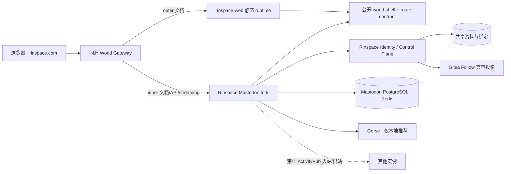

# Rinspace 表里世界技术设计

> 状态：技术设计已于 2026-09-05 确认。可据此生成实施任务；任务计划确认前不修改产品代码或生产环境。

## 1. 设计结论

Rinspace 在同一域名下运行两个独立 Web runtime：`rinspace-web` 负责表世界，Rinspace Mastodon fork 负责里世界。两者不使用 iframe，也不强行合并 React Router、Redux、Rails initial state、streaming 或 service worker；它们共同消费由公开仓库发布的世界路由契约与共享顶栏包，并由私有同源网关选择本次文档请求进入哪个 runtime。

第一阶段严格本地运行。Mastodon 只承载 Rinspace 本地账号、本地帖子、本地关注和本地互动；远端解析、抓取、收件、投递和发现同时在边缘、应用和网络出口关闭。里世界保留 Mastodon 的完整本地社交能力，并接入 Rinspace 已有 Gorse，提供“推荐”与“正在关注”两条信息流。



## 2. DESIGN SPECIFICATION

### 2.1 Purpose Statement

界面要让用户感觉自己始终留在同一个 Rinspace，只是把当前空间翻到安静的知识面或活跃的社交面。表世界突出书籍、博客和知识关系；里世界突出即时帖子、人与互动，同时避免成为现有讨论、问答和动态的第四套重复列表。

### 2.2 Aesthetic Direction

**Editorial/magazine（编辑式双面刊物）**。表世界像可停留阅读的刊物正面，里世界像同一本刊物不断更新的背面消息带；品牌、排版骨架与材质一致，信息密度和节奏明显不同。

### 2.3 Color Palette

沿用已存在的 Rinspace 品牌 token，不另造一套 Mastodon 主题：

| Token   | Light     | Dark      | 用途                   |
| ------- | --------- | --------- | ---------------------- |
| canvas  | `#F8FAFC` | `#0B1218` | 页面底色               |
| surface | `#FFFFFF` | `#111C25` | 顶栏与内容面           |
| ink     | `#2C3E50` | `#E8F0F5` | 主文字与主要图形       |
| accent  | `#2B577A` | `#83B4D4` | 当前状态、链接与主操作 |
| border  | `#CBD5DF` | `#40515E` | 信息分隔与结构线       |

这是对通用 UI 规范的品牌覆盖：颜色来自现有 `src/styles/tokens.css`，两个 runtime 必须消费同一版本的 token。

### 2.4 Typography

- 界面与社交信息：`IBM Plex Sans` + `Noto Sans SC`。
- 书籍、博客标题与需要编辑感的关键文字：`Newsreader` + `Noto Serif SC`。
- ID、时间、计数和技术性元数据：`IBM Plex Mono`。

字体均使用仓库已登记并随制品提供的版本，不由 Mastodon 页面临时访问第三方字体 CDN。

### 2.5 Layout Strategy

- 顶栏横跨全宽并保持稳定；Logo 与 `Rinspace` 文字是两个独立目标。
- 表世界使用不对称十二列编辑布局，让书籍与长文占据主要版面，标签和知识关系形成错位侧栏。
- 里世界在桌面端使用“窄功能轨—主时间线—发现侧栏”的三段布局，主时间线以连续分隔线组织帖子，不使用一组居中悬浮卡片。
- 移动端收成单列时间线；全局顶栏保留 Logo、品牌、搜索与账号，里世界高频栏目可落到底部导航，但不得与顶栏重复同一组操作。
- 顶栏以下的主体承担左右翻面；顶栏本身不旋转。

## 3. 设计原则

1. **同一产品，不同 runtime**：共享世界和顶栏契约，不共享彼此内部状态容器。
2. **固定 ID 是身份，slug/handle 是入口**：账号、帖子、标签绑定和关系都依赖不可变 ID。
3. **一个领域一个事实库**：身份资料属于 Rinspace，社交关系和帖子属于 Mastodon，排序属于 Gorse，其他副本只能重建。
4. **公开契约先行**：公共 UI、路由与 API 变更先在公开仓库形成可测试契约，再由私有仓库锁定消费。
5. **本地能力默认关闭联邦**：任何升级新增的远端路径或 worker 必须先分类，否则发布失败。
6. **渐进增强**：跨文档翻转动画、streaming、推荐和浏览量失败时都必须保留可用的基本导航或时间流。

## 4. 仓库与运行边界

| 组件                     | 权威职责                                                                   | 不承担的职责                                    |
| ------------------------ | -------------------------------------------------------------------------- | ----------------------------------------------- |
| `lunifans/rinspace-web`  | 表世界 UI、共享顶栏包、世界路由契约、公共 OpenAPI、确定性 Demo、设计 token | 生产密钥、Mastodon 数据、私有部署               |
| `lunifans/mastodon`      | 里世界 UI、帖子/互动/通知/列表、`/p` 地址、浏览量、推荐适配、严格本地模式  | 表世界正文、Gitea 内容权威、Rinspace 登录主数据 |
| 私有 `lunifans/rinspace` | 同源网关、OIDC/账号预配、资料和标签绑定、关系迁移、制品锁、生产配置        | 长期复制公开前端源码、并行维护第二套社交图      |
| Gorse                    | 对获准本地候选进行排序                                                     | 帖子存储、权限判断、内容审核、关注真值          |
| Gitea                    | 仓库、Star/Watch 与历史 User Follow 兼容投影                               | 新的用户关注写入权威                            |

### 4.1 公开前端消费方式

`rinspace-web` 的每个正式 release 应同时产生：

- 带哈希的表世界 core artifact；
- `@rinspace/world-shell` 离线 tarball，包含共享顶栏、世界解析器、token 和静态品牌资产；
- `contracts/world-routes.json` 及 schema；
- `contracts/openapi.yaml`、`version.json`、`SHA256SUMS`、SBOM 和 provenance。

私有仓库继续使用 `rinspace-web.lock.json` 固定 tag、40 位 commit、artifact SHA-256、API contract 与 world contract 版本。另增 `rinspace-mastodon.lock.json` 固定 fork tag、commit、上游基线、容器 digest 与所消费的 world-shell 摘要；一次部署的两份 lock 组合写入 `rinspace-stack.release.json`。生产不得消费 `main`、`latest`、本地未记录构建或可移动容器标签。

本地联调只通过两个显式 worktree 覆盖：

```text
RINSPACE_WEB_WORKTREE=/absolute/path/to/rinspace-web
RINSPACE_MASTODON_WORKTREE=/absolute/path/to/mastodon
```

启动器记录两个公开仓库和私有仓库的完整 commit、dirty 状态及契约版本，不复制源码。公开 PR 只运行合成 Demo 与公共契约检查；受保护的跨仓 workflow 以两个明确 commit 在 loopback 联调，成功结果只作为评审证据，不自动发布。

### 4.2 共享 world-shell

`@rinspace/world-shell` 使用 React 19 peer dependency，但不依赖 React Router、Redux、CloudBase SDK 或 Mastodon store。它只提供：

- `WorldState`、`WorldRoute`、`resolveWorld()`、`flipTarget()` 等纯函数；
- `RinspaceTopbar` 展示组件；
- 导航、搜索、主题、会话、通知和发布的端口接口；
- namespaced CSS、字体声明、Logo 与设计 token；
- 可访问性与跨文档 View Transition 协议。

`rinspace-web` 用 Router 7/auth ports 适配；Mastodon 用 Router 5/Redux/initial state 适配。顶栏只有一份组件源码，两个 runtime 只实现端口，不复制 DOM 和 CSS。

## 5. 世界状态与路由

### 5.1 URL 模型

`outer` 是默认世界，只在路径无法判断的双面资源上使用 `world=inner`：

| 资源                     | 表世界                  | 里世界                           |
| ------------------------ | ----------------------- | -------------------------------- |
| 首页                     | `/`                     | `/?world=inner`                  |
| 本地账号                 | `/@alice`               | `/@alice?world=inner`            |
| 已绑定标签               | `/tags/42/graph-theory` | `/tags/graph_theory?world=inner` |
| 搜索/通知/设置等重叠页面 | 无 `world`              | `?world=inner`                   |
| 表世界文章               | `/a/42/title`           | 无对应面                         |
| 里世界帖子               | 无对应面                | `/p/123/title`                   |

`world` 只接受 `inner`；`outer` 由省略表达。无效值被删除并回到路径默认世界。协议/API/媒体/静态资源不得携带或解释 `world`。

### 5.2 路由分类契约

`contracts/world-routes.json` 对每条路径声明下列一种类型：

- `dual`：同一路径存在两面，通过 `world` 区分；
- `outer-only`：只进入表世界；
- `inner-only`：只进入 Mastodon；
- `service`：API、streaming、OAuth、媒体和静态资源；
- `federation-disabled`：保留命名空间但一期在公网拒绝；
- `reserved`：不能被任何 catch-all 接管。

契约同时记录 canonical、反面目标解析器、anonymous policy 和 owning runtime。构建会生成 TypeScript resolver、Mastodon/Rails 测试 fixture 与网关 map；任何一方手工维护第二份路由表都视为失败。

### 5.3 网关解析顺序

浏览器文档请求按以下固定优先级处理：

1. 匹配 `service` 或 `federation-disabled`，不进入网页世界判断；
2. `/p/:id`、`/p/:id/:slug` 和其他 `inner-only` 路由进入 Mastodon；
3. `dual` 路由在 `world=inner` 时进入 Mastodon，否则进入表世界；
4. 明确的 `outer-only` 路由进入 `rinspace-web`；
5. 未分类地址返回 404，不进入当前 `/:username` 式 catch-all。

网关只对 `GET/HEAD` 且期望 HTML 的请求使用世界分流。`/rinspace/api/`、Mastodon `/api/`、`/oauth/`、`/auth/`、`/streaming/` 和静态前缀先按服务路由隔离。

### 5.4 导航和 canonical

- 普通导航把当前世界带到目标双面资源；只有 Logo 执行翻面。
- `Rinspace` 文字回当前世界首页。
- 单面资源点击 Logo 回相反世界首页。
- 双面资源缺少映射或无权访问时，也回相反世界首页，不猜测对象。
- 双面 inner 页 canonical 保留 `?world=inner`；outer 页省略 `world`；单面页删除无意义参数。
- 页面刷新、新标签页、前进/后退都仅根据 URL 恢复，不依赖 cookie 或 localStorage 才能判断世界。

## 6. 顶栏和翻面动效

### 6.1 顶栏行为

Logo 和品牌文字从当前单一 `<Link>` 拆为两个相邻、独立聚焦的控制：

- Logo：`aria-label="翻到里世界"` 或 `aria-label="翻到表世界"`，目标由 `flipTarget()` 计算；
- `Rinspace` 文字：`aria-label="返回当前世界首页"`；
- 搜索、发布、通知、主题和账号菜单通过 runtime adapter 执行当前世界行为；
- Logo 本身第一期不增加 hover 翻转状态反馈。

### 6.2 跨文档翻转

正式环境的两个 runtime 是独立文档，因此使用同源 Cross-Document View Transitions 渐进增强：

1. 点击 Logo 时记录方向 `outer-to-inner` 或 `inner-to-outer`；
2. 顶栏在旧、新文档使用同一 `view-transition-name`，保持静止；
3. 主体旧快照绕 Y 轴向一侧退出，新主体从另一侧进入；
4. 新文档恢复目标页标题、焦点和滚动策略；
5. 不支持该 API 时直接导航并淡入；`prefers-reduced-motion` 时取消 3D 旋转。

翻转失败、目标 runtime 不健康或映射无效时显示可恢复错误，不循环跳转。只有 Logo 导航触发该动效，普通站内链接不伪装成翻面。

### 6.3 Service Worker 边界

Mastodon 的 service worker 目前以 `/` 为 scope，并在安装时缓存 `/`；在本设计中 `/` 已是表世界，因此 fork 必须改为缓存 `/?world=inner`。它的 fetch handler 只缓存明确的 Mastodon 静态/媒体前缀，不接管表世界 HTML 或 API；通知点击统一打开 `/p/...` 或 inner 双面 URL。`rinspace-web` 的 MSW 仅存在于 demo，不得在 official runtime 注册第二个根作用域 worker。

## 7. 身份、资料和 handle

### 7.1 权威模型

| 数据                   | 权威键                                           | 权威系统               |
| ---------------------- | ------------------------------------------------ | ---------------------- |
| 登录主体               | `rinspace_subject`                               | Rinspace Identity      |
| Mastodon 绑定          | `rinspace_subject ↔ mastodon_user_id/account_id` | Rinspace Control Plane |
| 当前 handle 与共享资料 | `rinspace_subject`                               | Rinspace Identity      |
| 帖子作者               | `mastodon_account_id`                            | Mastodon               |
| 本地关注关系           | Mastodon account IDs                             | Mastodon               |
| Gitea Follow           | 稳定用户 ID 投影                                 | 可重建兼容层           |

两个世界展示同一个当前 handle、头像、资料和关注计数，但内容主体分别读取表世界贡献与 Mastodon statuses。

### 7.2 无感 SSO 和预配

1. 用户先通过 Rinspace 登录并获得稳定 subject；
2. 首次进入需要身份的里世界页面时，Control Plane 幂等预配 Mastodon User/Account；
3. Mastodon 使用 OIDC `sub` 查找既有绑定，禁止默认的“冲突时追加数字”逻辑；
4. 浏览器完成 one-click SSO，不要求第二次注册、密码或 username；
5. 绑定冲突进入对账状态，禁止发帖和关注写入，不创建近似账号。

会话 cookie、CSRF token 和 OAuth state 使用不同名称与最小范围；共同登录不意味着共享两个应用的内部 CSRF 或 access token。

### 7.3 handle 改名

handle 只是当前个人主页入口，改名采用可恢复 saga：

1. Identity 原子占用并校验新 handle；
2. Control Plane 以稳定绑定更新同一个 Mastodon Account 和缓存；
3. 两面 `/@new` 同时可读后提交变更；
4. 旧 handle 解除绑定并回到普通名称池，不建立永久保留记录；
5. 旧 `/@old` 在无人重新注册时返回 404，被其他账号注册后只表示新持有人。

过程中账号 ID、followers/following、帖子作者、帖子 ID 和 `/p` 地址不变。失败时保留最后一次完整可读状态并进入对账，不能让两个世界长期显示不同 handle。

## 8. 一张本地关注图

Mastodon 的 Follow/Unfollow、锁定账号审批、计数、列表、通知、静音和屏蔽已形成完整事务边界，因此 Mastodon 是社交关系唯一事实库。Rinspace Control Plane 暴露统一命令与读取入口，但写入最终调用 Mastodon 服务；外层 UI 在成功前显示 pending，不先修改 Gitea 或本地计数伪造成功。

迁移顺序：

1. 使用稳定 identity binding 将 Gitea User Follow 映射到 Mastodon account IDs；
2. 全量幂等导入本地关系，无法唯一匹配的记录进入人工队列；
3. 增量追平并双读比对关系和计数；
4. 切断 Gitea 新 User Follow 写入；
5. Mastodon 事件更新 Gitea 兼容投影；
6. 连续对账通过后删除双读，不长期双写。

Gitea Star、Watch、仓库协作和内容收藏不参加迁移。

## 9. 标签两面

新增 `tag_world_bindings` 逻辑实体，至少包含：

| 字段                    | 作用                                       |
| ----------------------- | ------------------------------------------ |
| `rin_tag_id`            | Rinspace 稳定知识标签 ID，唯一             |
| `mastodon_tag_id`       | Mastodon Tag ID，唯一                      |
| `mastodon_name`         | 当前 hashtag 名称                          |
| `state`                 | `active`、`pending`、`retired`、`conflict` |
| `created_at/updated_at` | 审计与对账                                 |

表世界点击标签进入 ID-first 知识页；里世界点击 hashtag 保持 inner 状态并进入实时话题。Logo 只有在 binding 为 `active` 时翻到同一标签另一面，否则回相反世界首页。本地帖子出现未绑定 hashtag 时只创建 Mastodon Tag，不自动创建知识标签。

绑定修改、合并和退休由 Rinspace 治理入口执行，使用唯一约束与审计；不能用字符串替换临时猜测，因为现有知识标签允许连字符而 Mastodon hashtag 不允许。

## 10. Mastodon 严格本地模式

fork 增加不可被普通管理员 UI 打开的部署级 `RINSPACE_LOCAL_ONLY_MODE=true`。防线分为三层：

### 10.1 公网边缘

- 拒绝 WebFinger、NodeInfo、ActivityPub actor/inbox/outbox/followers/following、status activity/replies/likes/shares、context 和 payload 等联邦请求；
- 不根据 `Accept: application/activity+json` 把普通网页转换成协议对象；
- 阻断远端域名账号路径和远端 URL resolve；
- 保留命名空间，不把它们分配给 Rinspace 网页。

### 10.2 Mastodon 应用

- 搜索、关注、提及、导入和 API 遇到远端账号或状态时返回稳定的 `local_only.remote_resource_disabled`；
- delivery、inbox、fetch、resolve 和 remote refresh 服务在入口处 fail closed；
- 升级新增的 route、service 或 Sidekiq job 未进入 allowlist 时使发布检查失败；
- 本地关注、通知、streaming、列表、投票、引用、举报等不依赖联邦的功能继续工作。

### 10.3 网络与监控

- Mastodon Web/Sidekiq 使用出站 allowlist，只允许数据库、Redis、对象存储、Identity/Control Plane、Gorse 和明确的本地基础设施；
- 联邦 delivery、remote fetch、inbox 队列深度和对应出站请求必须持续为零；
- 合成探针验证公网协议入口拒绝、远端搜索失败且本地功能成功。

未来联邦只能通过新规格移除此门禁；不能靠改变一个生产环境变量直接开放。

## 11. 帖子、永久地址与 slug

### 11.1 唯一网页地址族

- `/p/:id/:slug` 是帖子 canonical；
- `/p/:id` 按 ID 查找并临时规范化到当前 slug；
- `/p/:id/:wrongSlug` 仍按 ID 正常读取，再使用 302/客户端 replace 修正当前地址；不用 308，以免正文编辑后的旧 slug 被永久缓存；
- Mastodon 原生 `/@username/:statusId` 与 `/@username/:statusId/embed` 不兼容、不重定向并返回 404；
- REST Status 的 `url`、站内卡片、通知、搜索、分享、Open Graph 与结构化数据全部生成 `/p`；ActivityPub `uri` 保留独立协议语义但一期不公开。

### 11.2 slug-v1

slug 只由当前可公开到 URL 的帖子正文生成，不持久化为身份：

1. 取纯文本并进行 Unicode NFKC 规范化；
2. 删除 URL、email、`@mention`、控制字符和 HTML；
3. 保留汉字、其他字母与数字，把连续空白/标点折叠为 `-`；
4. 转为小写并按 grapheme 边界截到 48 个字符；
5. 空内容、仅媒体、仅 mention、followers-only 或 direct 帖子统一使用 `post`；内容警告、媒体文件名和不可见正文不得进入 slug。

正文编辑后 slug 可变，但 ID 不变；不保存历史 slug 表，任何旧/错 slug 都由 ID 恢复。生成器需版本化并使用跨 Ruby/TypeScript 的同一 fixture。

### 11.3 Mastodon 对象映射

| 对象                             | 网页地址策略                                                      |
| -------------------------------- | ----------------------------------------------------------------- |
| 原帖、回复                       | 各自使用自身 status ID 的 `/p`                                    |
| 引用帖                           | 引用者的 status 使用自身 `/p`，被引用帖保持自身 `/p`              |
| boost/repost wrapper             | 不创建独立公开网页；feed 中链接原帖 `/p`，活动 ID 只用于内部/协议 |
| poll                             | 随所属 status 展示，不创建公共 slug                               |
| media                            | 保留独立媒体资源路由，不冒充帖子                                  |
| list、notification、conversation | 使用受权内部 ID，不创建公共可读 slug                              |
| account                          | 只使用当前 `/@username`，两面通过 world 状态区分                  |
| hashtag                          | 使用 Mastodon name，并通过 binding 与知识 tag ID 对应             |

## 12. 里世界信息架构

### 12.1 首页

已登录用户进入 `/?world=inner` 时，主时间线顶部提供：

- **推荐**：默认标签，个性化本地帖子流；
- **正在关注**：严格按本地关注图和时间排序的非个性化流。

用户主动选择跨会话保存在 Rinspace profile preference；关闭个性化推荐后，“推荐”不再出现，首页默认“正在关注”。访客看到明确标注的本地热门/最新公开内容和登录入口，不建立匿名个性化画像。

帖子操作统一为回复、repost、喜欢、浏览量、收藏、分享；引用、媒体、投票、内容警告、可见性、提及、编辑历史和举报继续使用 Mastodon 原生权限模型。

### 12.2 个人页

两面共享同一身份头部：头像、封面、昵称、handle、简介、关注按钮和计数。主体按世界独立加载：

- `/@username`：博客、书籍、知识贡献；
- `/@username?world=inner`：帖子、回复、媒体和社交活动。

任一内容服务失败只影响对应主体，不抹掉共享身份。普通资料页链接保持当前世界，Logo 翻到相同 account ID 的另一面。

## 13. 个性化推荐

### 13.1 推荐链路

Mastodon fork 提供 `GET /api/v1/timelines/recommended`：

1. 从 Mastodon 查询通过可见性、discoverable、审核、屏蔽/静音和本地模式过滤的候选 ID；
2. 使用稳定 item ID `mastodon-status:<status_id>` 请求内部 Gorse 排序；
3. 回到 Mastodon 按当前 viewer 再做一次授权过滤和 hydration；
4. 删除重复、作者自有、已隐藏和已看腻候选，并用获准本地热门补足；
5. 以标准 REST Status 返回，不让浏览器直连 Gorse。

只有 `public + discoverable + 审核可推荐` 的本地 status 进入共享候选池。unlisted、followers-only、direct、已删除、待审、举报处置中或被作者关闭发现的内容不进入 Gorse 候选；公开回复可推荐，但返回时必须带足够会话上下文。

### 13.2 信号

推荐只向本地 Gorse发送最小化事实：稳定 Rinspace subject、`mastodon-status:<id>`、绑定 tag/category、反馈类型、权重和时间，不发送帖子正文、真实身份信息、私信或完整访问日志。

初始信号等级由低到高为：有效浏览、喜欢、收藏、回复、repost/引用；隐藏、静音和举报为负向信号。权重存在版本化配置中，变更需审计和离线评估，不把虚假互动写回 Mastodon。用户关注作者用于候选/过滤，不复制成伪造的帖子点赞。

### 13.3 用户控制和合规

- 首次展示“推荐”时显著说明个性化排序及主要目的；
- 设置中提供立即关闭个性化、查看/删除兴趣标签和清除推荐画像；
- “正在关注”始终是不针对个人兴趣特征的替代选项；
- 每次响应记录算法/配置版本和非个人化 reason code，不记录正文；
- 推荐不可用、超时或合规门禁未通过时只关闭“推荐”，不影响关注流。

这些设计对应《互联网信息服务算法推荐管理规定》第十六、十七条关于显著告知、非个性化/关闭选项及用户标签管理的要求。是否需要备案或安全评估必须在上线前由实际服务属性和届时规则判定，而不是由代码注释自行宣布豁免。

## 14. 浏览量

Mastodon 上游的 [Status entity](https://docs.joinmastodon.org/entities/Status/) 和 [`status_stats`](https://github.com/mastodon/mastodon/blob/main/app/models/status_stat.rb) 没有浏览量，因此这是 fork 扩展。产品口径参考 [X 官方浏览量说明](https://help.x.com/en/using-x/view-counts)，采用“总浏览次数”而不是独立访客数：已登录本地用户的多次独立浏览可以重复计数，作者查看自己的帖子也计数；预取、后台请求和 embed 不计数。该语义应在帮助页公开。

### 14.1 有效浏览

客户端仅在以下条件同时满足后发送事件：

- 帖子位于首页、搜索、个人页、标签页、会话页或详情页的可见 UI；
- 至少 50% 卡片进入视口并持续 1 秒，或详情主体成功渲染并持续 1 秒；
- 页面处于 visible 状态；
- 不是预加载、服务端渲染、爬虫、embed 或自动化健康检查。

### 14.2 计数链路

1. 客户端向 `POST /api/v1/statuses/:id/view` 发送随机 event ID；
2. Mastodon 先校验登录、帖子可见性和本地 status；
3. Redis 使用 viewer、status、客户端 session 与 5 分钟窗口的 HMAC key `SET NX EX`，抑制同一展示产生的重复 observer/重试；
4. Sidekiq 对 `status_stats.views_count` 执行原子增加；
5. 同一用户在另一次合格展示中可再次计数，公开数字明确不是 unique viewers；
6. Redis 去重键到期即删除，不建立可长期反查用户的浏览事件表。

`views_count` 作为 bigint 加入 `StatusStat`、REST serializer、TypeScript API type 和帖子 UI。public/unlisted 帖子向所有有权查看者展示；followers-only 只向授权用户展示；direct 不显示浏览量。删除 status 时计数随 `status_stats` 级联删除，不进入 ActivityPub payload。

浏览事件可另行产生一个最小化 `read` 推荐反馈；关闭个性化后不得再写 Gorse read feedback，但公共聚合浏览量仍可按上述规则计数。

## 15. API、事件和数据一致性

### 15.1 公共契约变化

- world route contract 新增世界分类、canonical 与 flip target；
- REST Status 新增可选 `views_count`，旧客户端可忽略；
- 新增 recommended timeline 和 view event API；
- 统一 session/profile contract 提供稳定 subject 的公开投影，但不向浏览器暴露内部绑定 ID；
- Tag API 增加可选 world binding 状态。

所有新增响应字段先可选，不能在同一 contract version 改变既有字段含义。破坏性修改遵循现有 90 天/两个公开 minor release 的双版本窗口。

### 15.2 内部事件

使用 transactional outbox 传递：

- `identity.profile.updated`；
- `identity.handle.changed`；
- `social.follow.changed`；
- `social.status.published/updated/deleted`；
- `social.interaction.changed`；
- `tag.binding.changed`。

事件使用稳定 ID、版本和幂等键。消费者保存 cursor/处理记录，可重放并对账；任何投影落后不得反向变成权威写入。

### 15.3 需要新增或调整的逻辑数据

| 数据                            | 位置                | 说明                                                  |
| ------------------------------- | ------------------- | ----------------------------------------------------- |
| identity binding                | Control Plane       | subject 与 Mastodon User/Account 唯一绑定、状态、版本 |
| tag world binding               | Control Plane       | Rin tag ID 与 Mastodon Tag 的唯一映射                 |
| world/recommendation preference | Rinspace profile    | 初始 feed、个性化开关与用户可管理标签                 |
| `status_stats.views_count`      | Mastodon PostgreSQL | 聚合总浏览次数                                        |
| view dedupe key                 | Mastodon Redis      | 5 分钟短期 HMAC 去重，无永久明细表                    |
| recommendation items/feedback   | Gorse               | 仅本地、最小化、可删除的排序输入                      |

## 16. 安全与中国法工程门禁

本设计不是律师意见。上线检查至少包括：

- 发布、回复和互动写权限接入符合“后台实名、前台自愿”的认证状态；
- 资料、实名信息、公开 handle 与内部绑定分层授权；
- 内容审核、举报、申诉、处置通知、记录保存和应急流程可实际执行；
- 个性化推荐具备显著告知、关闭、非个性化替代、标签管理、投诉和适用备案/评估证据；
- 自动化决策和阅读信号完成个人信息保护影响评估，具有访问、更正、删除/停止处理路径；
- local-only 三层门禁和零联邦网络证据通过；
- CSP、CSRF、OIDC state、cookie、CORS、上传、媒体、streaming 和 service worker 经过同源组合测试；
- 日志不记录 token、实名材料、私密正文、完整阅读轨迹或生产秘密。

主要法规基线沿用 requirements 中的官方文本，算法设计另直接对照[《互联网信息服务算法推荐管理规定》](https://www.cac.gov.cn/2022-01/04/c_1642894606364259.htm)。

## 17. 渐进发布与回滚

### Phase A：公开契约与 Demo

- 在 `rinspace-web` 建立 world route schema/resolver、共享 world-shell 和合成 inner 预览；
- 拆分 Logo/品牌文字，验证世界内导航、canonical、键盘和 reduced motion；
- Demo 只证明跨世界契约，不重写一套假 Mastodon。

### Phase B：Mastodon 本地基线

- 固定 fork 上游基线并建立持续同步策略；
- 落地 local-only 三层门禁、`/p`、slug、REST URL 与 route 404；
- 接入共享顶栏并处理 service worker/root 路由冲突。

### Phase C：身份、资料、标签和关注

- 建立预配与 OIDC 稳定绑定；
- 上线共享资料/handle saga 和 tag binding；
- 迁移 Gitea Follow，完成单图切换与对账。

### Phase D：完整里世界

- 开放本地发帖、回复、repost、喜欢、收藏、分享、引用、媒体、投票、通知、列表、举报和 streaming；
- 接入“推荐/正在关注”、Gorse、浏览量与用户控制；
- 完成桌面/移动端的信息架构和翻转动效。

### Phase E：灰度与正式切换

- 先部署隐藏且不可写的 same-origin staging；
- 再对内部账号开放、校验实名/内容/算法门禁；
- 按账号灰度写入和推荐，最后开放世界入口；
- 每阶段可独立关闭 inner 入口、写入、关系迁移、推荐和浏览量，联邦始终不可打开。

回滚切回上一组 `rinspace-stack.release.json` 和不可变制品。回滚不得删除 Mastodon 账号、帖子、互动或 ID；数据迁移用前向修复，不能恢复 Gitea 双写。

## 18. 验证策略

### 18.1 `rinspace-web`

- world resolver/canonical/flip target 属性测试；
- 85 条现有路由迁移到显式分类并拒绝 catch-all 漏接；
- 顶栏端口契约、键盘、屏幕阅读器、主题、移动端和 reduced-motion 测试；
- root、profile、tag、single-face 的跨文档导航和合成 Demo 浏览器测试；
- public artifact、world-shell tarball、route contract、checksum 与许可证门禁。

### 18.2 Mastodon fork

- `/p`、错 slug、敏感 slug、REST `url` 和 `/@username/:statusId` 404 的 Rails/JS 测试；
- local-only 的 route/service/worker/network deny matrix；
- OIDC 预配冲突、handle 改名/释放、资料投影和关注事务测试；
- `views_count` 并发原子性、授权、短期去重和删除测试；
- 推荐候选授权、Gorse 超时降级、负反馈、关闭个性化和标签删除测试；
- 上游 Mastodon test suite 与 fork patch inventory。

### 18.3 私有集成与发布

- 网关对全部 route contract 的 runtime 分配测试；
- 同一浏览器跨两个 runtime 的登录、登出、主题、profile、follow 和翻面 E2E；
- service worker、push、streaming、CSP、CSRF 和错误恢复测试；
- Gitea Follow 迁移/对账演练，数据库备份与前向修复演练；
- 零联邦出站证明、内容/算法/个人信息门禁 evidence；
- 三仓精确 commit、双 lock、镜像 digest、SBOM、provenance 与 AGPL 对应源码链接。

## 19. 明确放弃的方案

- `/community` 或 `/inner` 栏目路径：不能表达同一资源的两面。
- iframe：破坏认证、导航、可访问性、样式和安全边界。
- 把 Mastodon 全部源码编入 Router 7：上游升级成本和运行时耦合过高。
- 两套顶栏复制粘贴：必然产生行为和视觉漂移。
- cookie/localStorage 作为唯一世界状态：链接不可分享和恢复。
- Gitea 与 Mastodon 长期双写关注：会形成不可调和的两张粉丝图。
- `/@username/:statusId` 兼容或重定向：继续把可变 handle 混入帖子地址。
- 直接公开 ActivityPub 再依靠运营补救：不符合一期严格本地边界。

## 20. 已确认的整体取舍

产品已于 2026-09-05 确认以下组合：

1. 同源双 runtime + 公开 `world-shell`/route contract，而不是合并源码；
2. inner 双面 URL 使用 `?world=inner`；
3. 里世界默认“推荐”，保留“正在关注”并记忆选择；
4. 浏览量采用 X 式总浏览次数和 5 分钟技术去重，不宣称独立访客；
5. boost wrapper 不建立公开 `/p`，所有用户可点击链接落到原帖；
6. 严格本地模式必须由边缘、应用和网络三层共同保证。

实施任务按公开前端、Mastodon fork、私有集成和上线门禁拆分；任务计划整体确认后才进入产品代码实施。

## 21. 需求追踪

| 需求                                       | 设计章节         |
| ------------------------------------------ | ---------------- |
| R1–R3 世界状态、Logo 与导航                | 5、6             |
| R4 表世界信息架构                          | 2、4、17         |
| R5 里世界完整能力                          | 10–14            |
| R6–R8 同一账号、SSO、资料与 handle         | 7                |
| R9 一张关注图                              | 8                |
| R10 帖子永久地址                           | 11               |
| R11 标签两面                               | 9                |
| R12–R13 Mastodon 对象、协议与路由冲突      | 5、10、11        |
| R14 公开/私有仓库协作                      | 4                |
| R15 迁移与渐进发布                         | 8、17            |
| R16–R18 账号、内容、个人信息、推荐与浏览量 | 13、14、16       |
| R19 安全、可访问性与运行质量               | 5、6、10、16、18 |
